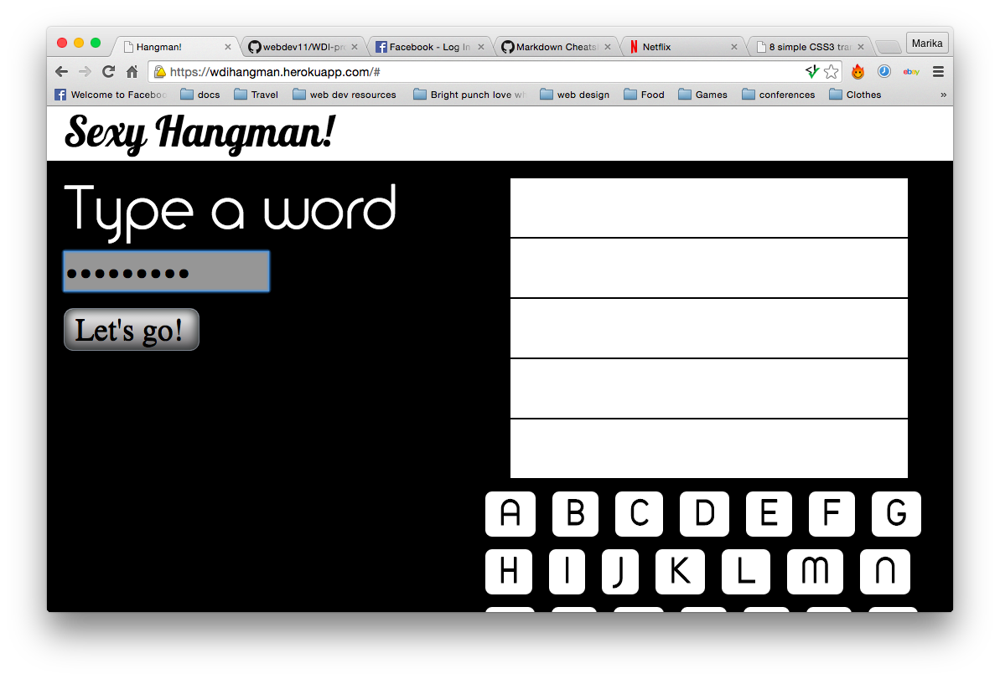

#Hangman!

**My Idea**

I came up with idea for this game when I remembered how much I loved playing hangman. 

**How it was built**

I built the game in jquery html and css.

#####Rules

1. player one types a word.

2. player 2 tries to guess the word by pushing the letter buttons.
3. letter will appear if the correct button is chosen.
4. if an imcorrect letter is chosen part of the div will disappear.
5. the player has five turns.
if the game is over a message will appear and a button asking if they want to play again.

# Hangman

###GA WDI London - Project 1

#### The classic Hangman game!

This version of Hangman has two game options:

1. Play with a friend, where one of you enters a word and the other guesses 
2. Select a category from a dropdown list and the computer will randomly generate a word for you to guess

#####[Play it here!](https://hangman-wdi-one.herokuapp.com/ "Here!")

1. Guess a letter by clicking on it
2. If the letter is in the word one or more times, it will appear in it's correct location within the word
3. If a guess is incorrect, the letter will be blacked out, and one part of the hangman will be drawn
4. If the word is correctly guessed before the hangman is completely drawn, you win! 
5. If the hangman is completely drawn (after 9 incorrect guesses) it's Game Over!

####Approach / How it works

If the user chooses to input their own word, it is stored in the 'input' variable. The spaces are converted to '/' and the capital letters to lower case. If the user chooses to generate a word, it is randomly picked from an array based on their chosen category, and saved in the 'input' variable. This variable is then split into an array to seperate the letters and symbols.

The letters and hidden word are created dynamically, and once a letter selection is made it is determined whether or not the guess is correct. If a guess is correct, the letter or letters will appear. If a guess is incorrect, one part of the hangman is drawn. If 9 incorrect guesses are made, it is Game Over!

There are sounds that are triggered upon:

1. A correct guess
2. An incorrect guess
3. Game Over
4. A win!
5. Letter rollover
6. Start of the game

####The build

* HTML 5, CSS and jQuery were used to create this game. 
* Animation was created using the Animate.css stylesheet. 
* Soundmanager was used to load the sounds. 
* The Google Web Font 'Arvo' has been used to style the game.

#### Problems & Challenges

The main challenge I faced building this game, was how to link the user guesses with the revealing of correct letters. I needed to select the correct letter div that had the same name or value as the guessed letter. I am pleased with the solution that I came up with. The other challenge I had was how to centre the pop-ups vertically within the setup div, which I eventually achieved using 
positioning and percentages. 

